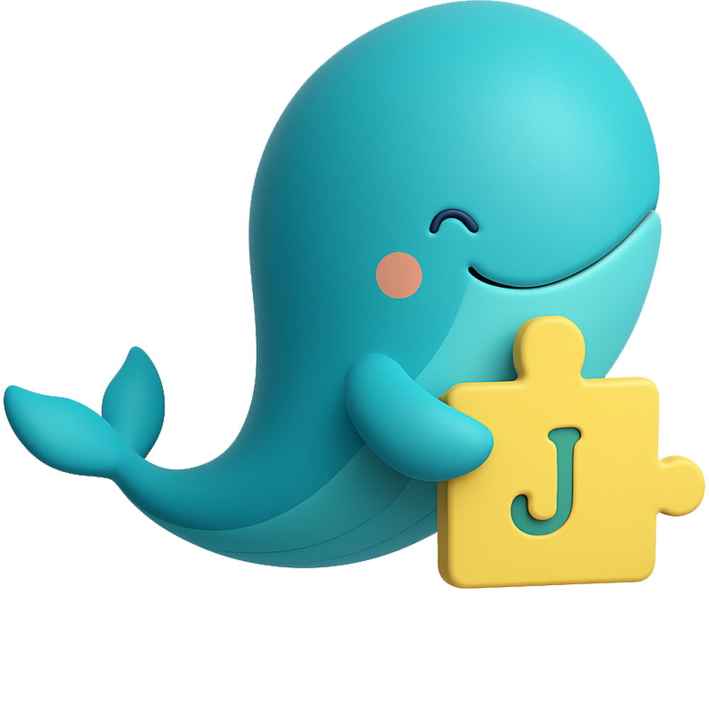

# Proyecto Ecomerce Journey 🐋

Bienvenido a nuestra plataforma de e-commerce especializada en productos didácticos para niños y niñas con TEA (Trastorno del Espectro Autista). Diseñada para facilitar la exploración, compra y venta de materiales adaptados que fomentan el aprendizaje, la estimulación sensorial y el desarrollo integral. Con una interfaz moderna e intuitiva, ofrecemos un catálogo cuidadosamente seleccionado, filtros personalizados, carrito de compras eficiente y gestión segura de usuarios. Nuestra misión es brindar una experiencia accesible y confiable para familias y profesionales que buscan recursos educativos inclusivos y de calidad.

<h3 style="text-align:center;" align="center">🤝 Colaboradores</h3> 

<table align="center">
<tr>

<td align="center">
<a href="https://github.com/httpsmarioooo">
 

<b>Carlos Torres</b>

</a>
</td>

<td align="center">
<a href="https://github.com/CodingtheMJ">
 

<b>MJ Gonzalez</b>

</a>
</td>

<td align="center">
<a href="https://github.com/DanielleSaint">
 

<b>Daniela Santacruz</b>

</a>
</td>

<td align="center">
<a href="https://github.com/gabriel-pinilla-c">
 

<b>Gabriel Pinilla</b>

</a>
</td>

<td align="center">
<a href="https://github.com/Tatiana-Casas">
 

<b>Tatiana Casas</b>

</a>
</td>

</tr>
</table>

## 🛠 Tecnologías y Herramientas

